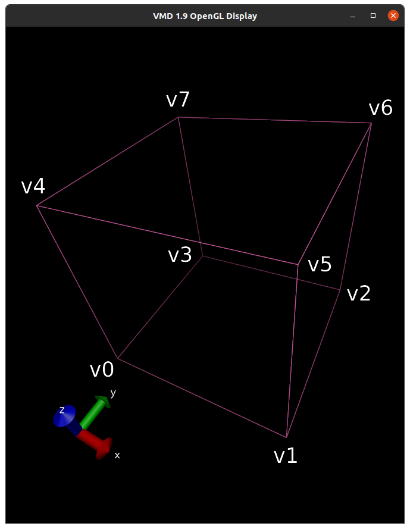
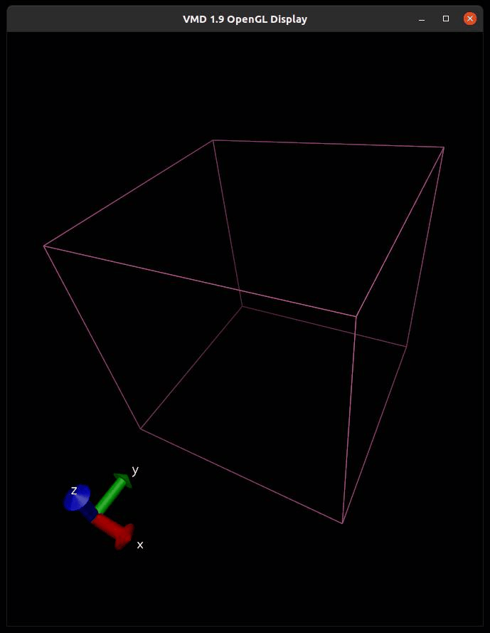

# Marching Tetrahedrons Domain Decomposition

Code implementing the domain decomposition used in the marching tetrahedrons algorithm.
The whole domain is decomposed in cubes that are then decomposed in tetrahedrons as follows:

In each cube, tetrahedrons are enumerated as follows:
* T0: v0 - v1 - v3 - v5
* T1: v1 - v2 - v3 - v5
* T2: v0 - v3 - v4 - v5
* T3: v2 - v3 - v5 - v6
* T4: v3 - v5 - v6 - v7
* T5: v3 - v4 - v5 - v7

